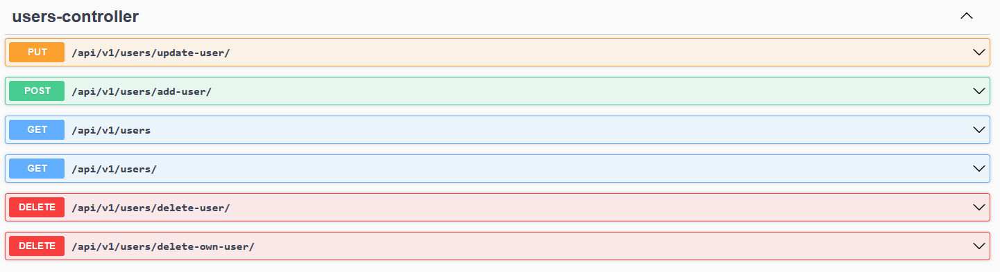
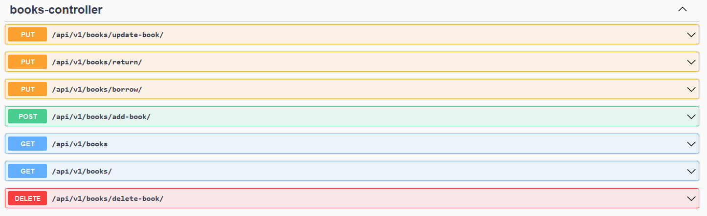
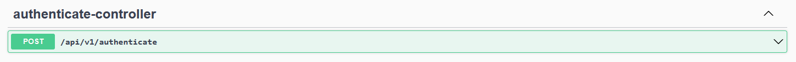

# Java Interview Assignment  
Spring Boot application that will be used by our candidates to implement interview assignment.

Build a REST application for a library system which offers two endpoints; /books and /users.

Test units also been created for controller, service and repository layer by using JUnit5 and Mockito.

## Dependencies
This project relies mainly on Spring Boot. Mainly:
  - Spring Data JPA
  - Spring Security
  - Spring Web
  
Full list of dependencies can be found in [pom.xml][1].

## Requirements:
  - Candidates expected to implement required features based on provided scenario
  - Each implementation should be equipped with unit tests
  - Integration tests are require to demonstrate API usages

### Scenario
The are two roles in the system; `LIBRARIAN` and `MEMBER`

#### Access Rights:
  - Write operations (Create, Update, and Delete) on **/books** can only be performed by LIBRARIAN while read operation can be performed by both LIBRARIAN and MEMBER LIBRARIAN can perform all operations on **/users** while MEMBER can only perform read and delete operation. 
  - A MEMBER can only delete their own account while LIBRARIAN can delete all accounts.
  - Users without either roles are not allowed to access either of these paths.
  
#### Updating Book Status:
  - A MEMBER should be able to borrow a book. Once a book is borrowed, its status will be changed to BORROWED.
  - Once a MEMBER has returned the book then its status will be changed from BORROWED to AVAILABLE

## Step by step to configure and run the application
1. Please checkout the source code and import as maven project.
2. Find the **posmy.interview.boot.Application** class and run the application.
3. Insert the dummy data that had been provided at **..\resources\script_db\00.00.01\data.sql**.
4. To insert the data please open the link http://localhost:8080/h2-console and login (To find the username and password, please take a look into **application.properties** file).
5. Please copy and paste the query. And run the query.
6. To ensure the users and features tables was successfully loaded the data, simply run on below query

**Available Users after run the script:**
|Role: |LIBRARIAN|
| --- | --- |
|Username: |alex@gmail.com|
|Password: |password|

|Role: |MEMBER|
| --- | --- |
|Username: |julia@gmail.com|
|Password: |password|

## Testing API using OpenApi
1. The application already integrated with the OpenApi. To test it simply open the link http://localhost:8080/swagger-ui/index.html
2. Choose any one of the availble API. And fill-in any necessary information that needed. After that click Execute to run the API.

**Notes: Please bear in mind, most of the APIs required token to be include in the header (Spring Security Mechanism). Alternative you can test using PostMan**

## List of Available APIs

#### Users controller
   

#### books controller
   

#### Authenticate controller
   

## Definition Tables 

### 1. USERS Table
| Coloumn | Description |
| --- | --- |
| id | User Id |
| email | User Email |
| password | User Password |
| role | User role (LIBRARIAN/MEMBER) |

### 2. BOOKS Table
| Coloumn | Description |
| --- | --- |
| id | Book Id |
| author | Book author |
| book_title | Book title |
| book_description | Book description |
| status | Book status (AVAILABLE/BORROWED) |

### 3. BOOK_BORROWED_BY_USER Table
| Coloumn | Description |
| --- | --- |
| user_id | Foreign key of **id** (Primary Key) USERS table |
| book_id | Foreign key of **id** (Primary Key) BOOKS table |

## Nice to Have:
It will be an advantage for candidates to demonstrate the following:

  - proper usage of Http Methods and REST practices
  - understanding of [SOLID Principle][2]
  - understanding of Design patterns
  - understanding of TDD and BDD
    
## Submission:
Candidates can submit their assignments via:
  - [Pull Request](https://docs.github.com/en/github/collaborating-with-issues-and-pull-requests/about-pull-requests) (preferred)
  - Cloud storage of their choice
  - Email

[1]: pom.xml
[2]: https://en.wikipedia.org/wiki/SOLID

